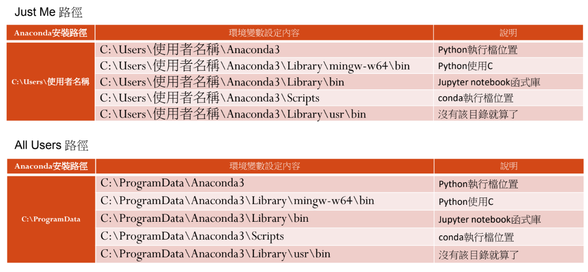
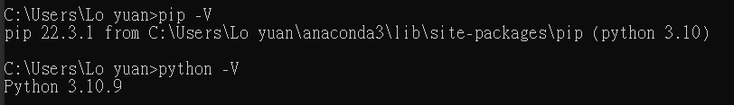

# 安裝 Anaconda

## 設定環境變數

桌面 > (右鍵) > 內容 > 環境變數 > 系統變數 > path

`Just Me 路徑`

```Python
C:\Users\使用者名稱\Anaconda3
C:\Users\使用者名稱\Anaconda3\Library\mingw-w64\bin
C:\Users\使用者名稱\Anaconda3\Library\bin
C:\Users\使用者名稱\Anaconda3\Scripts
C:\Users\使用者名稱\Anaconda3\Library\usr\bin
```

`All Users 路徑`

```Python
C:\ProgramData\Anaconda3
C:\ProgramData\Anaconda3\Library\mingw-w64\bin
C:\ProgramData\Anaconda3\Library\bin
C:\ProgramData\Anaconda3\Scripts
C:\ProgramData\Anaconda3\Library\usr\bin
```

<div align=center></div>

_補充說明_

如果環境變數設置完成，可以去 CMD 確認

```Python
pip -V
python -V
```



# pip 指令

[pip 版本查詢](https://pypi.org/project/pandas/#history)

以下皆在 CMD 操作

## 查看已安裝套件與版本

```Python
pip list
```

## 查詢套件狀態

```Python
pip show <套件名稱>
```

如果沒有安裝 CMD 會顯示`WARNING: Package(s) not found: pyquery`

## 套件安裝

```Python
pip install <套件名稱>
```

### 套件安裝特定版本

```Python
pip install pandas==2.1.1 -U
```

有時可能會存取被拒，依照說明補加指令

以 pandas 為例

```Python
pip install pandas==2.1.1 -U --user
```

## 套件移除

```Python
pip uninstall <套件名稱>
```

## 更新套件

```Python
pip install -U <套件名稱>
```

## pip 更新自己

_擇一使用_

```Python
python -m pip install --upgrade pip
pip install --upgrade pip
pip install pip -U
```
